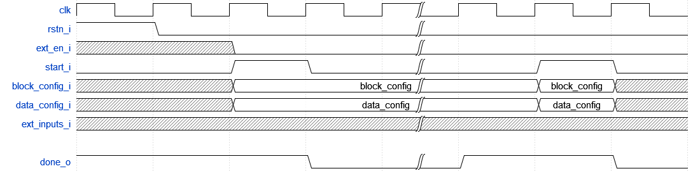
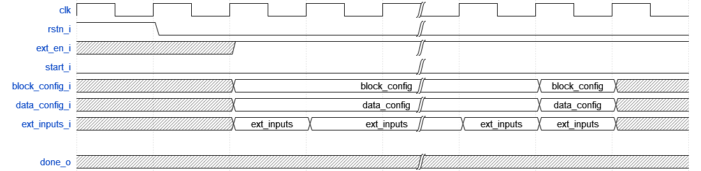
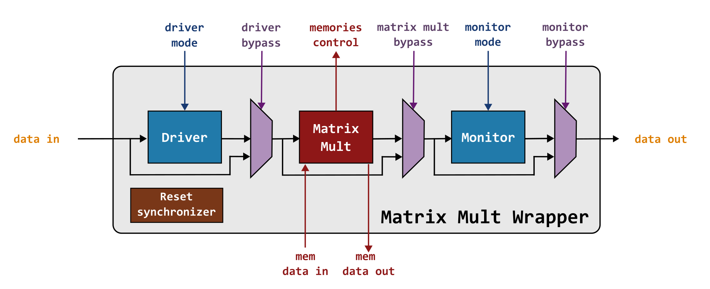
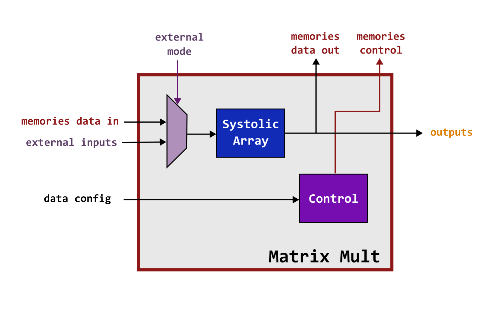
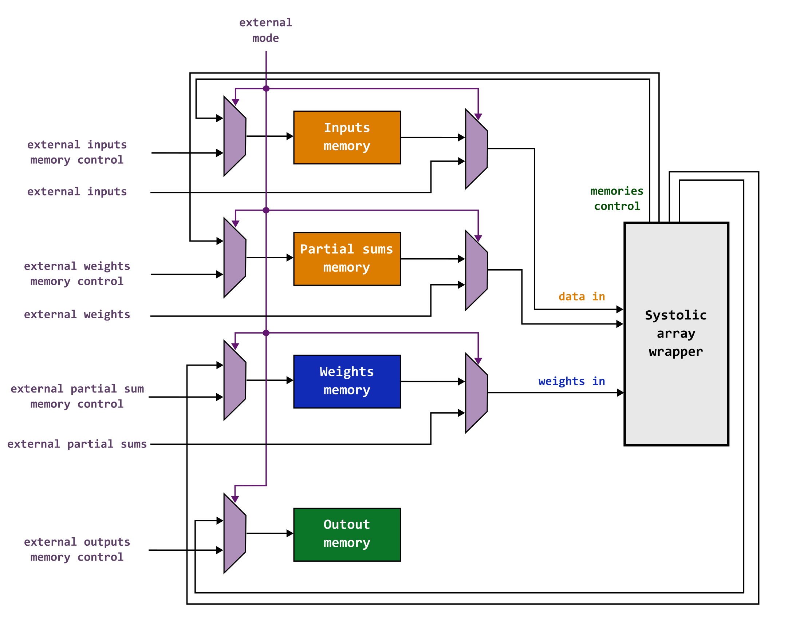

Project Description
====================
You will implement and tapeout a **Systolic Array-based Matrix Multiplication Unit** in pre-assigned teams. This will involve (1) understanding the systolic array weight stationary dataflow and modeling its behavior using a high level programming language such as C or Python; (2) Describing your design in RTL; and (3) perform synthesis and APR on your design. You will verify that the module is functional, and meets target specifications at each intermediate stage of the process. Eventually, your Systolic Array design will be taped out and you will test the chip and characterize its performance and power.

## Objectives
1.1.1 Understand how a Weight Stationary Systolic Array works. Properly.

1.1.2 Demonstrate your ability to implement a given algorithm in RTL using the best-practices learned in this class.

1.1.3. Construct a good verification flow that works across behavioral, post-syn, and post-apr to ensure a successful tapeout.

1.2.1. Add input source and output select logic for your module, including LFSR and BIST function.

1.2.2. Perform synthesis to meet provided functional specifications.

1.2.3. Perform auto place and route to generate a tapeout ready design.

1.2.4. Understand what files to provide for the final chip integration. Deliver the ndm of your design.

1.3.1. Understand how your module is intergrated and interacts with the peripherals.

1.3.2. Understand and perform several methods to test the chip.

1.3.3. Observe how the chip performs and think about how each step of the flow affects the end result.

1.3.4. Successfully tapeout a Systolic Array that meets target specifications.

## Systolic Arrays
A systolic array is a specialized hardware architecture consisting of a grid of interconnected processing elements (PEs) that perform parallel computations. Data "pulses" through the array in a synchronized rhythmic fashion like a heartbeat (hence the name "systolic") with each PE performing a simple operation and passing the result to its neighbors. 

Systolic Arrays are highly efficient for tasks that involve a series of repetitive, localized computations, such as matrix multiplication and convolutions which are the fundamental operations enabling modern Machine Learning models, and digital signal processing.

The primary objectives of a systolic array are:
1. **Minimize Data Movement**: data is fed into the array and re-used as much as possible minimizing how many times it needs to be fetched from memory.
2. **Maximize Parallelism**: many PEs perform computations simultaneously, in fact, they are all active during steady-state.

### Weight Stationary Dataflow
For this project, you will be designing a Weight Stationary Systolic Array. Please use the [systolic overview slides](https://gatech.instructure.com/courses/468924/files/folder/References?preview=66116019) and any additional resources that you can find online as a reference for your design.

## Specifications
Here are the specifications of the Matrix Multiplication Unit you are implementing:

| Feature                             | Description                      |
|-------------------------------------|----------------------------------|
| Number of rows                      | 4 (Programable by Designer)      |
| Number of columns                   | 4 (Programable by Designer)      |
| Input data assumptions              | Data is stored on global memories |
| Input data format                   | Signed Integer (2's Complement)  |
| Input data width                    | 8 bits                           | ## we probably need more integer bits
| Output data width                   | 8 bits                           | ## Need to discuss this one
| Handling data overflow              | Saturation                       | ## Need to discuss this one
| Modes supported                     | Memory, External, & BiST         |
| IO ports                            | See [cordic_top.sv](src/verilog/cordic_top.sv)| ## update link once files are updated
| Reset                               | Active-Low Reset (Reset when 0)  |
| Process node                        | TSMC 65GP                        |
| Timing model                        | NLDM                             |
| Power supply                        | 0.8 ~ 1 V                        |
| Target corner                       | TT                               |
| Minimum clock frequency             | 100 Mhz                          |
| Highest metal allowed               | M7                               |

Your design should support the following modes:

1. Memory mode: The memories are loaded and available. The control logic should load the weights into the array, process all inputs and partial sums, and save the results in the output memory.

   Shown below is an example of the input and expected output pattern. Assume that the input, weights, and partial-sum memories have already been loaded. The input block configuration and data configuration are fed to your Systolic Array module when the start bit is set. After processing, the done signal indicates completion, and the results are written to the output memory.

<p align="center">

</p>

2. External mode: The memories are not available, and all signals come from external sources. In this mode, the systolic array functions purely as a processing unit, while an external entity manages all inputs, control signals, and outputs.

   Shown below is an example of the input and expected output pattern. Assume that the weights have already been loaded into the array. In this case, your testbench should manage all inputs, partial sums, and outputs.
   
<p align="center">

</p>

3. BiST mode: This mode revolves around using the LFSR and Singature Analyzer to do at-speed testing. It is very similar to the External mode. Memories are not available and inputs, control, and outputs are managed by an external entity. The difference comes in that input activations are now generated by the LFSR, streamed into the systolic array, and then compressed on the Signature Analyzer. Once the Signature is ready (which is determined by the LFSR's stop code) it will be used to determine if incorrect values were produced. This mode helps us isolate the design from the memory interface, providing a setup to test the design at maximum speed.

Explore the use of _genvar_ to build a customizable number of stages.

**Your design should be parameterizable. You may be asked to change the number of rows, columns, data width, and the position of the fixed point before submitting the final version.**

**The header verilog file for the design has been provided.**

## Matrix Multiplication Wrapper
The Matrix Mult wrapper includes 3 main blocks: a driver, a monitor and the Matrix Mult module. In driver mode 1, the driver flops the incoming test pattern, and sends it out to the Matrix Mult module in the next cycle. In driver mode 0, the LFSR inside the driver generates the test patterns and feed it to the Matrix Mult module. In monitor mode 1, the monitor flops the Matrix Mult module's output and pops it out the next cycle to external modules. In monitor mode 0, the signature analyzer inside the monitor collects the Matrix Mult module's ouputs and compresses those until it receives the stop signal. Then, one ouput will be sent out from the monitor.

The data input port is also used to set the seed of LFSR and SA when in driver mode 0 or monitor mode 0. Provide the seed when reset is low to set LFSR and SA seed. Once the reset goes high, LFSR will start to generate pattern automatically. LFSR stops and notifies SA to stop as well when the generated pattern matches the stop pattern on the stop code input port.

Please start by running the simulation with the provided sequence in task.sv, alter the modes and see how driver and monitor behave when the Systolic module is bypassed. Other than the 3 main modules, there's also a reset synchronizer in the wrapper that makes sure the reset is in sync with the clock that the wrapper receives.

| Driver Mode | Description      |
|-------------|------------------|
| 0           | LSFR             |
| 1           | External Input   |

| Monitor Mode| Description      |
|-------------|------------------|
| 0           | Signature Analyzer  |
| 1           | Direct Output    |

Driver Mode and Monitor mode can be seen as internal bypasses inside these modules.

<p align="center">

</p>

<p align="center">

</p>

There will be 4 memories shared with all groups. the simplified diagram is shown bellow.

<p align="center">

</p>

## Milestone timeline
| Milestone | Date            | Item                                                      |
|-----------|-----------------|-----------------------------------------------------------|
| 1a (solo) | 10/03 | High-Level Bit-Accurate Weight Stationary Systolic Array Simulator  |
| 1b (solo) | 10/12 | A Functionally Complete and Verified **Simplified** Matrix Mult Module |
| 1 (team)  | 10/23 | A Functionally Complete and Verified Matrix Mult Module             |
| 2         | 10/26 | Verified, Post-synthesis Matrix Mult Module                         |
| 3         | 11/02 | Verified, Post-APR Matrix Mult Module                               |
| 4         | 11/09 | Chip-level Validation, Final SAPR Delivery with post-review changes |
| Peer      | 11/29 | Peer Review                                                         |

## Milestone 1 Deliverables
### Milestone 1-a (solo)
1. A script written in a high level programing language such as python or C that models the behavior of your weight stationary systolic array based matrix multiplication unit on a bit level. Unlike the provided high level script, your high level should match the output of your module. We have specified the format of the [input data file](scripts/cordic_input.txt).
2. A Readme that clearly explains the organization of your design and how to run the high level simulation model.
 
 ```bash
<gtid>_ms1_a.tar.gz
|
|-scripts---------------------------|
|                                   |-file1
|                                   |-file2
|                                   |-...
```

### Milestone 1-b (solo)
For this milestone you will work by yourself to design a slightly simplified version of the final matrix mult unit. You will use this implementation as a starting point when working together as groups. 
THe instructions for Milestone 1-b can be found on a separate repository: [Milestone 1-b](https://github.gatech.edu/ECE-4804-F22/milestone_1b).
 
### Team Portion:
Each team will submit one tar.gz through Canvas with filename _group<group_number>\_ms1.tar.gz_. The file should include the below deliverables organized the same as the directories in tutorials.
1. A functionally correct and verified Systolic RTL design integrated with the **Systolic wrapper**. Remember to rename the module systolic_top_<group_number> to have the appropriate group number.
2. A test framework that is used to verify your design.
3. A Readme that clearly explains the organization of your design and how to run both the high level simulation model and test framework.
**Note**: Your design must meet all of the specifications listed on this repository.

## Milestone 2 Deliverables
Each team will submit one tar.gz through Canvas with filename _group<group_number>\_ms2.tar.gz_. The tar file should include the following deliverables, which can be found in your _syn_ directory, structured as below.

```bash
group<group_number>\_ms2.tar.gz
|
|-results---------------------------|
|                                   |-file1
|                                   |-file2
|                                   |-...
|        
|-reports---------------------------|
                                    |-file1
                                    |-file2
                                    |-...
```

## Milestone 3 Deliverables
Each team will submit one tar.gz through Canvas with filename _group<group_number>\_ms3.tar.gz_. The file should include the following deliverables, which can be found in your _apr_ directory, structured as below.

```bash
group<group_number>\_ms3.tar.gz
|
|-results---------------------------|
|                                   |-file1
|                                   |-file2
|                                   |-...
|        
|-reports---------------------------|
|                                   |-file1
|                                   |-file2
|                                   |-...
|        
|-cordic_wrapper_<groupnum>_lib-----|
                                    |-dir1
                                    |-file1
```

## Milestone 4 Deliverables
Each team will submit one tar.gz through Canvas with filename _group<group_number>\_ms4.tar.gz_. The file should include the following deliverables, which can be found in your _apr_ directory, structured as below.

```bash
group<group_number>\_ms4.tar.gz
|
|
|-results---------------------------|
|                                   |-file1
|                                   |-file2
|                                   |-...
|        
|-reports---------------------------|
|                                   |-file1
|                                   |-file2
|                                   |-...
|        
|-cordic_wrapper_<groupnum>_lib-----|
                                    |-dir1
                                    |-file1
```

## Team Common Directories on ECE Linux Machine
Each team has been given a common directory for them to store files for their group. You only have the permission to write to files that are in your group. Please `cd` the full path directly to access. 

``` bash
/home/ece4804/projects/group_<group_number>
```

**Collaboration between groups is highly encouraged. However, NO COPYING**
