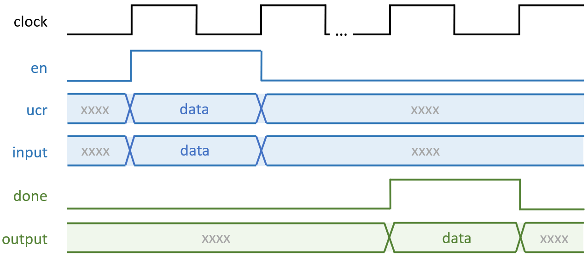
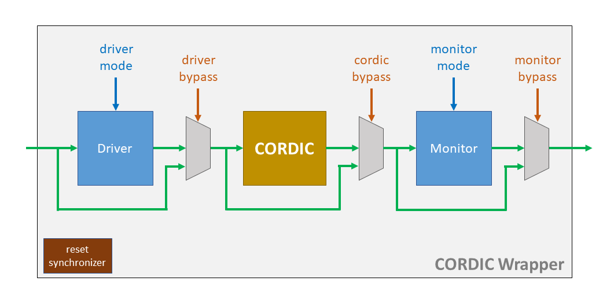

Project Description
====================
You will implement and tapeout a **CORDIC** (COordinate Rotation DIgital Computer) in pre-assigned teams. This will involve (1) understanding the CORDIC algorithm and  modeling its behavior using a high level programming language such as C or Python; (2) Describing your design in RTL; and (3) perform synthesis and APR on your design. You will verify that the module is functional, and meets target specifications at each intermediate stage of the process. Eventually, your CORDIC design will be taped out and you will test the chip and characterize its performance and power.

## Objectives
1.1.1 Understand the CORDIC algorithm. Properly.

1.1.2 Demonstrate your ability to implement a given algorithm in RTL using the best-practices learned in this class.

1.1.3. Construct a good verification flow to ensure a successful tapeout.

1.2.1. Add input source and output select logic for your module, including LFSR and BIST function.

1.2.2. Perform synthesis to meet provided functional specifications.

1.2.3. Perform auto place and route to generate a tapeout ready design.

1.2.4. Construct a good verification flow to validate your post-apr design.

1.2.5. Understand what files to provide for the final chip integration. Deliver the FRAM view of your design.

1.3.1. Understand how your module is intergrated and interacts with the peripharals.

1.3.2. Understand and perform several methods to test the chip.

1.3.3. Observe how the chip performs and think about how each step of the flow affects the end result.

1.3.4. Successfully tapeout a CORDIC that meets target specifications.

## CORDIC Algorithm
CORDIC is a shift-and-add algorithm that can calculate trigonometric functions, hyperbolic functions, square roots and more. Due to its simplicity and efficiency, CORDIC was used in the navigation system of the Apollo program's Lunar Roving Vehicle, processors, such as Intel 8087, and FPGAs. Please read the provided [slide](doc/CORDIC_slide.pdf) and [paper](doc/CORDIC_paper.pdf) to clearly understand the CORDIC operations. A high level script has been provided to check your knowledge against. This scripts does not satisfy the requirements for Milestone 1, but feel free to use it as a base. By now, you should appreciate the value of building a firm foundation upon which to mount your effort. Doing otherwise typically takes up even more time, and leads to poor quality.

## Specifications
Here are the specifications of the CORDIC design you are implementing:

| Feature                             | Description                      |
|-------------------------------------|----------------------------------|
| Number of micro-rotations           | 12 (User-programmable)           |
| Number of pipline stages            | Designer's Decision              |
| Input data timing assumptions       | Data can appear every cycle      |
| Input data format                   | Two's complement                 |
| Input data width                    | 16 bits (1 sign, 2 int, 13 frac) |
| Output data width                   | 18 bits (1 sign, 4 int, 13 frac) |
| Scaling factor                      | Compensate for scaling           |
| Coordinates supported               | Circular (m = 1)                 |
| Modes supported                     | Rotation & Vectoring             |
| IO ports                            | See [cordic_top.sv](src/verilog/cordic_top.sv)|
| Process node                        | TSMC 65GP                        |
| Timing model                        | NLDM                             |
| Power supply                        | 0.8 ~ 1 V                        |
| Target corner                       | TT                               |
| Minimum clock frequency             | 100 Mhz                          |
| Highest metal allowed               | M5                               |

Shown below is an example of the input and expected output pattern. Input data and function (equivalent to the mode mentioned in the paper and high level sim) are fed to your CORDIC module for one cycle when the enable bit is set. After processing, the output result is presented with done signal indicating the completion for one cycle.

<p align="center">

</p>

Explore the use of _genvar_ to build a customizable number of stages.

**The header verilog file for the design has been provided**

## CORDIC Wrapper
The CORDIC wrapper includes 3 main blocks: a driver, a monitor and the CORDIC module. In driver mode 0, the driver flops the incoming test pattern, and sends it out to the CORDIC module in the next cycle. In driver mode 1, the LFSR inside the driver generates the test patterns and feed it to the CORDIC module. In monitor mode 0, the monitor flops the CORDIC module's output and pops it out the next cycle to external modules. In monitor mode 1, the signature analyzer inside the monitor collects the CORDIC module's ouputs and compresses those until it receives the stop signa. Then, one ouput will be sent out from the monitor. 

The data input port is also used to set the seed of LFSR and SA when in driver mode 1 or monitor mode 1. Provide the seed when reset is high to set LFSR and SA seed. Once the reset goes low, LFSR will start to generate pattern automatically. LFSR stops and notifies SA to stop as well when the generated pattern matches the stop pattern on the stop code input port.

Please start by running the simulation with the provided sequence in task.sv, alter the modes and see how driver and monitor behave when the CORDIC module is bypassed. Other than the 3 main modules, there's also a reset synchronizer in the wrapper that makes sure the reset is in sync with the clock that the wrapper receives.

| Driver Mode | Description      |
|-------------|------------------|
| 0           | External Input   |
| 1           | LSFR             |

| Monitor Mode| Description      |
|-------------|------------------|
| 0           | Direct Output    |
| 1           | Signature Analyzer  |

<p align="center">

</p>

## Milestone timeline
| Milestone | Date            | Item                                                      |
|-----------|-----------------|-----------------------------------------------------------|
| 1         | 10/28 | A Functionally Complete and Verified CORDIC Module with high level bit accurate script and readme                 |
| 2         | 11/04 | Verified, Post-synthesis CORDIC Module                              |
| 3         | 11/11 | Verified, Post-APR CORDIC Module                                    |
| 4         | 11/18 | Chip-level Validation, Final SAPR Delivery with post-review changes |
| Peer      | 12/02 | Peer Review                                                         |

## Milestone 1 Deliverables
Each team will submit one tar.gz through Canvas with filename _group<group_number>\_ms1.tar.gz_. The file should include the below deliverables organized the same as the directories in tutorials.
 1. A script written in a high level programing language such as python or C that models the CORDIC behavior on a bit level. Unlike the provided high level script, your high level should match the output of your CORDIC module. We have specified the format of the [input data file](scripts/cordic_input.txt).
 2. A functionally correct and verified CORDIC RTL design integrated with the CORDIC wrapper. Remember to rename the module cordic_top_groupnumber to have the appropriate group number.
 3. A test framework that is used to verify your design.
 4. A Readme that clearly explains the organization of your design and how to run both the high level simulation model and test framework.

## Milestone 2 Deliverables
Each team will submit one tar.gz through Canvas with filename _group<group_number>\_ms2.tar.gz_. The tar file should include the following deliverables, which can be found in your _syn_ directory, structured as below.

```bash
cordic_wrapper.tar.gz
|
|-cordic_wrapper-|
                 |-results---------------------------|
                 |                                   |-file1
                 |                                   |-file2
                 |                                   |-...
                 |        
                 |-reports---------------------------|
                 |                                   |-file1
                 |                                   |-file2
                 |                                   |-...
                 |        
                 |-cordic_wrapper_lib----------------|
                                                     |-dir1
                                                     |-file1
```

## Milestone 3 Deliverables
Each team will submit one tar.gz through Canvas with filename _group<group_number>\_ms3.tar.gz_. The file should include the following deliverables, which can be found in your _apr_ directory, structured as below.

```bash
cordic_wrapper.tar.gz
|
|-cordic_wrapper-|
                 |-results---------------------------|
                 |                                   |-file1
                 |                                   |-file2
                 |                                   |-...
                 |        
                 |-reports---------------------------|
                 |                                   |-file1
                 |                                   |-file2
                 |                                   |-...
                 |        
                 |-cordic_wrapper_lib----------------|
                                                     |-dir1
                                                     |-file1
```

## Milestone 4 Deliverables
Each team will submit one tar.gz through Canvas with filename _group<group_number>\_ms4.tar.gz_. The file should include the following deliverables, which can be found in your _apr_ directory, structured as below.

```bash
cordic_wrapper.tar.gz
|
|-cordic_wrapper-|
                 |-results---------------------------|
                 |                                   |-file1
                 |                                   |-file2
                 |                                   |-...
                 |        
                 |-reports---------------------------|
                 |                                   |-file1
                 |                                   |-file2
                 |                                   |-...
                 |        
                 |-cordic_wrapper_lib----------------|
                                                     |-dir1
                                                     |-file1
```

## Team Common Directories on ECE Linux Machine
Each team has been given a common directory for them to store files for their group. You only have the permission to write to files that are in your group. Please `cd` the full path directly to access. 

``` bash
/tools/projects/ece4804/group<group_number>
```

**Collaboration between groups is highly encouraged. However, NO COPYING**
